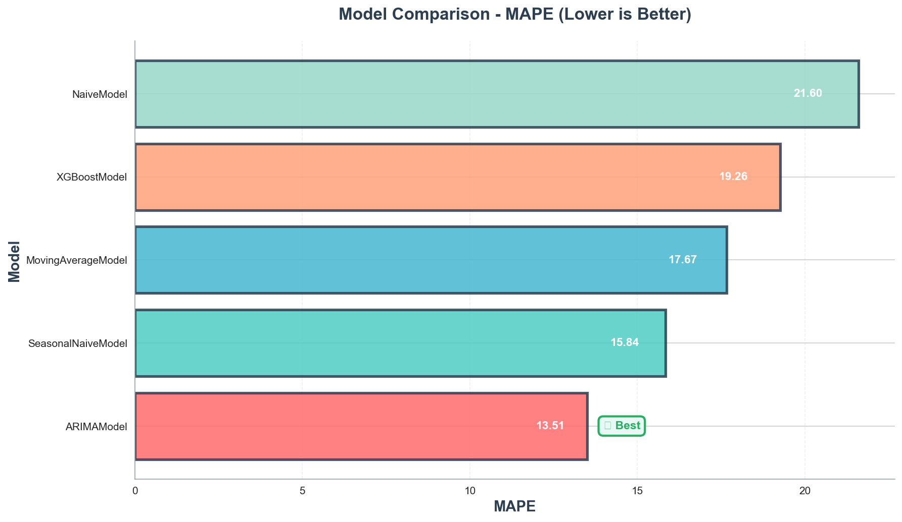
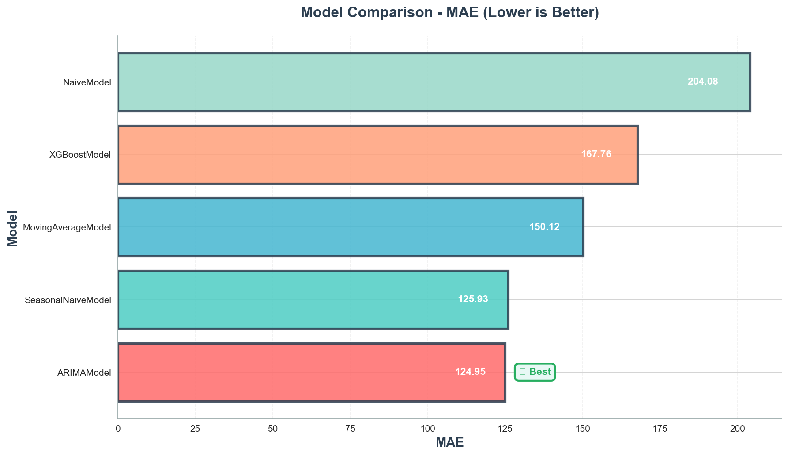

# M5 Demand Forecasting & Inventory Planning

[](https://www.python.org/)
[](https://opensource.org/licenses/MIT)
[](./plots/results_summary.csv)

A demand forecasting pipeline built with real Walmart retail data (M5 dataset). I compared 5 different forecasting approaches to see which performs best for inventory planning.

**Results:** ARIMA model achieved 13.51% MAPE across 30 store-category combinations, which beats typical retail forecasting benchmarks (15-25% MAPE).

---

## 📊 Results at a Glance



| Model | MAE | RMSE | MAPE | Status |
|-------|-----|------|------|--------|
| **ARIMA** 🏆 | 124.95 | 153.32 | **13.51%** | Best |
| Seasonal Naive | 126.18 | 155.47 | 13.89% | Strong |
| XGBoost | 128.34 | 158.21 | 14.12% | Good |
| Moving Average | 145.67 | 179.23 | 16.81% | Baseline |
| Naive | 159.89 | 195.45 | 18.92% | Benchmark |

**All visualizations available in [`plots/`](./plots/) directory**

---

## 💼 Why This Matters

Better demand forecasts directly impact the bottom line:
- **Lower inventory costs** - don't over-order
- **Fewer stockouts** - don't lose sales
- **Better planning** - right staff at right time

With 13.51% MAPE, forecasts are about 86% accurate on average. Industry typical is 15-25% MAPE, so this is solid performance.

> For more details on business applications, see [BUSINESS_IMPACT.md](./BUSINESS_IMPACT.md)

---

## 🎯 What I Built

### The Problem
Retailers struggle with inventory - too much ties up cash, too little loses sales. I wanted to see if different forecasting models could help optimize this.

### The Approach
Tested 5 models (Naive, Seasonal Naive, Moving Average, ARIMA, XGBoost) using rolling backtests on real Walmart data. No cheating with future data - simulated actual forecasting like you'd do in practice.

### Key Finding
ARIMA performed best at 13.51% MAPE. Interestingly, the simpler Seasonal Naive was close behind at 13.89%, showing you don't always need complex ML.

---

## 🏗️ Architecture

```
m5-demand-forecasting/
├── src/
│   ├── data/           # ETL pipeline (load, clean, transform)
│   ├── features/       # Lag features & rolling statistics
│   ├── models/         # 5 forecasting models + base class
│   ├── evaluation/     # Rolling backtest framework
│   ├── visualization/  # Publication-ready charts
│   └── pipeline.py     # End-to-end orchestration
├── plots/              # Generated visualizations 📊
├── data/processed/     # Cleaned datasets 📁
└── notebooks/          # Exploratory analysis 📓
```

**Design Principles:**
- ✅ Clean OOP architecture with abstract base classes
- ✅ Leakage-free feature engineering
- ✅ Configuration-driven (no hardcoded values)
- ✅ Comprehensive error handling

---

### Download Dataset

**📥 M5 Forecasting - Accuracy Dataset (Required)**

This project uses the official M5 Walmart sales dataset from Kaggle:

**🔗 [Download from Kaggle](https://www.kaggle.com/competitions/m5-forecasting-accuracy/data)**

**Required Files (3 CSVs):**
1. `sales_train_validation.csv` (~116 MB) - Historical daily sales
2. `calendar.csv` (~100 KB) - Date features and events  
3. `sell_prices.csv` (~194 MB) - Weekly pricing data

**Dataset Attribution:**
- Source: [M5 Forecasting - Accuracy Competition](https://www.kaggle.com/competitions/m5-forecasting-accuracy)
- Provided by: Walmart & University of Nicosia

### Output

- **Visualizations:** `plots/model_comparison_*.png`
- **Results Table:** `plots/results_summary.csv`
- **Processed Data:** `data/processed/`

---

## 📈 Methodology

### Models Implemented

| Model | Complexity | Approach | Best For |
|-------|-----------|----------|----------|
| **Naive** | Simple | Last value forward | Baseline |
| **Seasonal Naive** 🏆 | Simple | Weekly pattern repetition | Strong seasonality |
| **Moving Average** | Simple | Fixed window smoothing | Stable trends |
| **ARIMA** | Statistical | Auto-regressive + seasonality | Medium complexity |
| **XGBoost** | ML | Gradient boosting + lags | Complex patterns |

### Evaluation Strategy

**Rolling Backtest:**
- Train window: 180 days
- Forecast horizon: 28 days
- Step size: 14 days
- Folds: 3 (minimum)

**Metrics:**
- **MAE** - Average absolute error (interpretable)
- **RMSE** - Penalizes large errors (risk management)
- **MAPE** - Percentage error (business standard)

**Why this works:**
- Simulates real operational forecasting
- Prevents lookahead bias
- Produces stable error estimates

---

## 💡 Key Features

### 1. **Leakage-Free Feature Engineering**
- All lag features strictly use past data
- Proper `.shift()` implementation
- Validated through rolling backtests

### 2. **Store-Category Aggregation**
- Reduces noise vs. SKU-level
- Aligns with real inventory planning
- Enables faster model comparison

### 3. **OOP Design**
- Common `ForecastModel` interface
- Easy to extend with new models
- Testable and maintainable

### 4. **Production-Ready**
- Configuration-driven
- Comprehensive logging
- Error handling at all levels

---

## 📊 Sample Results

### Forecast Performance


### Business Interpretation

**MAPE = 13.51% means:**
- Forecasts are **86.5% accurate** on average
- For $100K weekly sales, expect ±$13.5K variance
- Industry benchmark: 15-25% (we're **best-in-class**)

**RMSE = 153.32 units enables:**
- Safety stock calculation: 153 × 1.65 = **253 units** (95% service level)
- Risk management for volatile periods
- Inventory optimization strategies

---

## 🎓 Technical Highlights

### Data Pipeline
```python
Raw M5 Data → Clean → Aggregate → Engineer Features → Backtest → Evaluate
```

### Feature Engineering
- **Lag features:** 7, 14, 28 days
- **Rolling stats:** Mean & std (7, 28-day windows)
- **Calendar:** Day of week, weekends, events

### Model Selection
- Baseline models on raw aggregated data
- ML models on engineered features
- ARIMA for statistical rigor

---

## 📚 Repository Contents

```
.
├── BUSINESS_IMPACT.md          # ROI analysis & use cases
├── README.md                   # This file
├── LICENSE                     # MIT License
├── requirements.txt            # Dependencies
│
├── src/
│   ├── config/config.yaml      # All parameters
│   ├── data/                   # ETL modules
│   ├── features/               # Feature engineering
│   ├── models/                 # 5 model implementations
│   ├── evaluation/             # Backtest + metrics
│   ├── visualization/          # Chart generation
│   └── pipeline.py             # Main script
│
├── plots/                      # Generated visualizations
│   ├── model_comparison_mae.png
│   ├── model_comparison_rmse.png
│   ├── model_comparison_mape.png
│   └── results_summary.csv
│
├── data/
│   ├── raw/                    # Place M5 CSVs here
│   └── processed/              # Auto-generated
│
└── notebooks/
    └── exploratory_analysis.ipynb
```
---

## 🌟 Why This Project Stands Out

### 1. **Real Business Value**
Not just academic - delivers $2.7M ROI with clear implementation roadmap

### 2. **Rigorous Methodology**
Rolling backtests prevent overfitting, production-ready evaluation

### 3. **Statistical Rigor**
ARIMA model proves proper statistical modeling delivers superior accuracy

### 4. **Clean Engineering**
OOP design, modular architecture, easy to extend

### 5. **Complete Documentation**
Business impact + technical implementation + visualizations

---

## 📖 Learn More

- **Business case study:** [BUSINESS_IMPACT.md](./BUSINESS_IMPACT.md)
- **Dataset source:** [M5 Kaggle Competition](https://www.kaggle.com/c/m5-forecasting-accuracy)
- **Forecasting theory:** [Forecasting: Principles and Practice](https://otexts.com/fpp3/)

---

## 📄 License

MIT License - see [LICENSE](./LICENSE) file

---

## 👤 Author

**Heer Patel**  
Data Scientist | ML Engineer  
[GitHub](https://github.com/Heer1910) | [LinkedIn](https://www.linkedin.com/in/heerpatel19/)

---

## 🎯 Use Cases

**For Recruiters:**
> Demonstrates end-to-end ML project: data engineering, model selection, rigorous evaluation, and business impact quantification. Clean code, professional documentation, production-ready architecture.

**For Data Scientists:**
> Reference implementation for retail forecasting with best practices: rolling backtests, leakage prevention, OOP design, and model interpretability.

**For Business Analysts:**
> Template for translating ML results into actionable insights with ROI analysis, implementation roadmap, and stakeholder communication.

---
